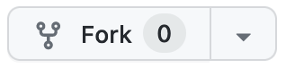

Classe inversée
===

Création d'un jeu du pendu dans une interface web.

Cette documentation est rédigée dans un fichier standard [README.md](./README.md) au format [Markdown](https://fr.wikipedia.org/wiki/Markdown).


## Mise en place

1. Créez un fork du dépôt avec le bouton `fork` :



2. Copiez l'URL de votre dépôt GitHub après le fork

3. Clonez le dépôt sur votre ordinateur :

```shell
git clone https://github.com/[[ votre nom utilisateur ]]/sonate_pendu
```

4. Placez vous dans le dossier du dépôt Git cloné :

```shell
cd sonate_pendu
```

A ce stade, vous devez voir en début de prompt du terminal : `(.venv)`

## Installation des bibliothèques

On peut employer un fichier (par convention [requirements.txt](./requirements.txt)) pour référencer les bibliothèques  et leurs versions nécessaires au projet.

On utilise le gestionnaire de bibliothèques [Pip](https://packaging.python.org/en/latest/tutorials/installing-packages/) pour les installer dans notre *virtual env* : 

```shell
pip install -r requirements.txt
```

Si l'étape s'est bien déroulée, le terminal affiche un message comme quoi les bibliothèques suivantes sont bien installées :

```
Successfully installed Flask-3.0.0 Jinja2-3.1.2 Werkzeug-3.0.1 blinker-1.7.0 click-8.1.7
```

## Lancement du serveur

Le fichier [server.py](./server.py) contient le strict minimum pour lancer un serveur web local avec Flask.

Le code est issu de la documentation [Quickstart](https://flask.palletsprojects.com/en/3.0.x/quickstart/#a-minimal-application).

```python
from flask import Flask

app = Flask(__name__)


@app.route("/")
def home():
    return "<p>Hello, World!</p>"
```

Notre fichier Python s'appelant `server.py`, on peut lancer l'application avec la commande suivante : 

```shell
flask --app server run
```

Le terminal doit afficher un message attestant que le serveur local à bien démarré :

```
* Serving Flask app 'server'
* Debug mode: off
WARNING: This is a development server. Do not use it in a production deployment. Use a production WSGI server instead.
* Running on http://127.0.0.1:5000
Press CTRL+C to quit
```

Les informations peuvent être décrites comme suit :

|Log|Description|
|---|-----------|
|`Serving Flask app 'server'`|Flask à démarré l'application nommée server en référence au fichier `server.py`|
|`Debug mode: off`|Le mode de debugging n'est pas actif (voir [Debug Mode](https://flask.palletsprojects.com/en/3.0.x/quickstart/#debug-mode)).|
|`WARNING: This is a development server. Do not use it in a production deployment. Use a production WSGI server instead.`|Indication que le serveur démarré est lancé par une commande destinée à un travail de développement. On utilise d'autres utilitaires comme Gunicorn pour faire fonctionner un serveur en production. Pour nos besoins, c'est suffisant.|
|`Running on http://127.0.0.1:5000`|Le serveur est actif et répond à l'URL [http://127.0.0.1:5000](http://127.0.0.1:5000) (5000 étant le port configuré par défaut). Vous pouvez cliquer sur le lien et ouvrir la page dans un navigateur web.|
|`Press CTRL+C to quit`|On peut mettre fin au processus en utilisant `CTRL + C`.|

## Développement

### Afficher des templates

Dans le fichier d'exemple [server.py](./server.py), c'est une sortie en HTML brut qui est réalisée :

```python
return "<p>Hello, World!</p>"
```

C'est fonctionnel mais pour réaliser des mises en forme plus complexes, on se retrouve très vite limité.

En effet, on a besoin d'une structure HTML de base égale pour toutes les pages : on parle de `layout` dans le domaine du développement web.

Un layout (en français *disposition*) est une page HTML structurée pour recevoir du contenu variable (corps de page). Le contenu de la page change en fonction d'où on se situe sur un site web, mais la structure (le layout) ne varie pas.

Par exemple, une entête avec un menu, un pied de page, sont des éléments qu'on peut intégrer dans un layout car ils restent souvent les mêmes, quelle que soit la page du site.

La première étape est de modifier le fichier [server.py](./server.py) pour qu'il affiche des templates HTML (on parle de *rendering* en anglais) :

[Rendering Templates](https://flask.palletsprojects.com/en/3.0.x/quickstart/#rendering-templates)

Le guide nous indique de faire 2 choses :

1. Modifier notre valeur retour de la sorte : 

```python
from flask import Flask, render_template

app = Flask(__name__)


@app.route("/")
def home():
    return render_template("hello.html")
```

2. Créer un fichier `templates/hello.html` :

```jinja
<!doctype html>
<title>Hello from Flask</title>
<h1>Hello, World!</h1>
```

Par la suite, on redémmare le serveur : 

```shell
flask --app server run
```
